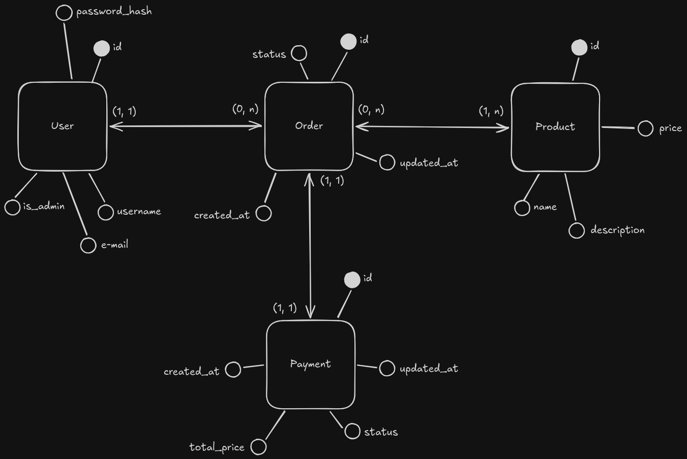

# ⚡ Hayai

API de e-commerce em Java com microsserviços e arquitetura orientada a eventos
via REST e Apache Kafka para pedidos e pagamentos.

---

## Como rodar o projeto

### Pré-requisitos

Antes de começar, você precisa ter instalado:

- Docker
- Docker Compose

### Subindo a aplicação

Na raiz do projeto, execute:

```bash
docker compose up -d
```

---

## Serviços

| Serviço           | Responsabilidade                                     |
|-------------------|------------------------------------------------------|
| `auth-service`    | Cadastro, gerenciamento de usuários e emissão de JWT |
| `product-service` | Cadastro e gerenciamento de produtos                 |
| `order-service`   | Controle do ciclo de vida dos pedidos                |
| `payment-service` | Processamento de pagamentos (simulado)               |

---

## Política de Deleção

> **Nunca ocorre deleção física de usuários ou produtos.**
>
> - Usuários são desativados via `is_active = FALSE` na tabela `users`.
> - Produtos são desativados via `is_active = FALSE` na tabela `products`.
>
> Isso preserva a integridade referencial de pedidos e pagamentos já existentes,
> evitando violações de FK e perda de histórico. Os eventos `users.deleted` e
> `products.deleted` no Kafka sinalizam essa desativação lógica — não uma
> remoção do banco de dados.

---

## Fluxos

### `POST /sign-up` — Cadastro de usuário

1. Cliente envia dados de cadastro
2. `auth-service` persiste o usuário
3. Evento `users.created` publicado no Kafka — retorna `201 Created`

### `DELETE /users/{id}` — Desativação de usuário _(authenticated)_

> Não ocorre remoção física. O usuário é marcado como inativo
> (`is_active = FALSE`).
>
> - Um **admin** pode desativar qualquer usuário.
> - Um **usuário comum** só pode desativar a si mesmo — tentativas de desativar
    > outro usuário retornam `403 Forbidden`.

1. Usuário envia requisição autenticada
2. `auth-service` verifica permissão: admin ou próprio usuário — caso contrário,
   retorna `403 Forbidden`
3. `auth-service` atualiza `is_active = FALSE` no registro do usuário
4. Evento `users.deleted` publicado no Kafka — retorna `204 No Content`

### `POST /sign-in` — Autenticação

1. Cliente envia credenciais
2. `auth-service` busca o usuário na tabela `users` pelo `username` ou `email`
3. `auth-service` rejeita o login se o usuário não existir ou tiver
   `is_active = FALSE` — retorna `403 Forbidden`
4. `auth-service` valida a senha contra `password_hash`
5. Token JWT é gerado e retornado ao cliente — retorna `200 OK`

### `GET /products` · `GET /products/{id}` — Consulta de produtos

1. Cliente envia requisição (pública)
2. `product-service` retorna apenas produtos com `is_active = TRUE` — retorna
   `200 OK`

### `POST /products` — Cadastro de produto _(admin only)_

1. Admin envia dados do produto com token JWT válido
2. `product-service` valida permissão de admin e persiste o produto
3. Evento `products.created` publicado no Kafka — retorna `201 Created`

### `PATCH /products/{id}` — Atualização de produto _(admin only)_

1. Admin envia campos a atualizar com token JWT válido
2. `product-service` aplica as alterações parciais
3. Retorna `200 OK` com produto atualizado

### `DELETE /products/{id}` — Desativação de produto _(admin only)_

> Não ocorre remoção física. O produto é marcado como inativo
> (`is_active = FALSE`).

1. Admin envia requisição com token JWT válido
2. `product-service` atualiza `is_active = FALSE` no registro do produto
3. Evento `products.deleted` publicado no Kafka — retorna `204 No Content`

### `POST /orders` — Criação de pedido _(authenticated)_

1. Cliente envia requisição autenticada com os dados do pedido
2. `order-service` valida o `user_id` contra `users_ref` (deve existir e ter
   `is_active = TRUE`)
3. `order-service` valida os `product_id` contra `products_ref` (devem existir
   e ter `is_active = TRUE`)
4. `order-service` persiste o pedido com status `PENDING`
5. Evento `orders.created` publicado no Kafka — retorna `201 Created`

### Processamento de pagamento _(interno — Kafka)_

1. `payment-service` consome o evento `orders.created`
2. Pagamento é processado (simulado)
3. Evento `payments.processed` publicado no Kafka

### Atualização de status do pedido _(interno — Kafka)_

1. `order-service` consome o evento `payments.processed`
2. Status do pedido é atualizado para `PAID` ou `FAILED`

### `GET /orders` · `GET /orders/{id}` — Consulta de pedidos _(authenticated)_

1. Cliente envia requisição autenticada
2. `order-service` retorna o histórico de pedidos do usuário — retorna `200 OK`

---

## Referência de Endpoints

| Método   | Endpoint         | Serviço           |
|----------|------------------|-------------------|
| `POST`   | `/sign-up`       | `auth-service`    |
| `DELETE` | `/users/{id}`    | `auth-service`    |
| `POST`   | `/sign-in`       | `auth-service`    |
| `GET`    | `/products`      | `product-service` |
| `GET`    | `/products/{id}` | `product-service` |
| `POST`   | `/products`      | `product-service` |
| `PATCH`  | `/products/{id}` | `product-service` |
| `DELETE` | `/products/{id}` | `product-service` |
| `POST`   | `/orders`        | `order-service`   |
| `GET`    | `/orders`        | `order-service`   |
| `GET`    | `/orders/{id}`   | `order-service`   |

---

## Eventos Kafka

| Tópico               | Publicado por     | Consumido por     |
|----------------------|-------------------|-------------------|
| `users.created`      | `auth-service`    | `order-service`   |
| `users.deleted`      | `auth-service`    | `order-service`   |
| `products.created`   | `product-service` | `order-service`   |
| `products.deleted`   | `product-service` | `order-service`   |
| `orders.created`     | `order-service`   | `payment-service` |
| `payments.processed` | `payment-service` | `order-service`   |

---

### `users.created`

Publicado quando um usuário é cadastrado. O `order-service` consome este evento
para manter `users_ref` populada com os `user_id` válidos — substituindo a FK
`orders.user_id → users("id")`.

```json
{
  "user_id": "uuid",
  "created_at": "timestamp"
}
```

### `users.deleted`

Publicado quando um usuário é **desativado** (`is_active = FALSE`). O
`order-service` consome este evento para atualizar `is_active = FALSE` em
`users_ref`, impedindo a criação de novos pedidos para usuários inativos. O
registro do usuário **não é removido** do banco de dados do `auth-service`.

```json
{
  "user_id": "uuid",
  "deleted_at": "timestamp"
}
```

### `products.created`

Publicado quando um produto é cadastrado. O `order-service` consome este evento
para manter `products_ref` populada com os `product_id` válidos — substituindo a
FK `orders_products.product_id → products("id")`.

```json
{
  "product_id": "uuid",
  "created_at": "timestamp"
}
```

### `products.deleted`

Publicado quando um produto é **desativado** (`is_active = FALSE`). O
`order-service` consome este evento para atualizar `is_active = FALSE` em
`products_ref`, impedindo que pedidos referenciem produtos inativos. O registro
do produto **não é removido** do banco de dados do `product-service`.

```json
{
  "product_id": "uuid",
  "deleted_at": "timestamp"
}
```

### `orders.created`

Publicado quando um pedido é criado com sucesso. O `payment-service` consome
este evento para duas finalidades: manter `orders_ref` populada com os
`order_id` válidos — substituindo a FK `payments.order_id → orders("id")` — e
iniciar o processamento do pagamento.

```json
{
  "order_id": "uuid",
  "user_id": "uuid",
  "amount": "numeric",
  "created_at": "timestamp"
}
```

### `payments.processed`

Publicado após o processamento do pagamento. O `order-service` usa este evento
para atualizar o status do pedido para `PAID` ou `FAILED` — garantindo
consistência sem acesso direto à tabela `payments`.

```json
{
  "payment_id": "uuid",
  "order_id": "uuid",
  "status": "PAID | FAILED",
  "processed_at": "timestamp"
}
```

---

## Modelagem de Dados



## Schemas

### `users` (`auth-service`)

```sql
CREATE TABLE users
(
    "id"          UUID PRIMARY KEY      DEFAULT gen_random_uuid(),
    is_admin      BOOLEAN      NOT NULL DEFAULT FALSE,
    is_active     BOOLEAN      NOT NULL DEFAULT TRUE,
    username      VARCHAR(16)  NOT NULL UNIQUE,
    email         VARCHAR(254) NOT NULL UNIQUE,
    password_hash TEXT         NOT NULL
);
```

### `products` (`product-service`)

```sql
CREATE TABLE products
(
    "id"          UUID PRIMARY KEY        DEFAULT gen_random_uuid(),
    is_active     BOOLEAN        NOT NULL DEFAULT TRUE,
    "name"        VARCHAR(64)    NOT NULL UNIQUE,
    "description" VARCHAR(2048)  NOT NULL,
    price         NUMERIC(11, 2) NOT NULL
);
```

### `users_ref`, `products_ref`, `orders`, `orders_products` (`order-service`)

```sql
CREATE TABLE users_ref
(
    user_id    UUID      NOT NULL PRIMARY KEY,
    is_active  BOOLEAN   NOT NULL DEFAULT TRUE,
    created_at TIMESTAMP NOT NULL DEFAULT now()
);

CREATE TABLE products_ref
(
    product_id UUID      NOT NULL PRIMARY KEY,
    is_active  BOOLEAN   NOT NULL DEFAULT TRUE,
    created_at TIMESTAMP NOT NULL DEFAULT now()
);

CREATE TYPE order_status AS ENUM ('PENDING', 'PAID', 'FAILED');

CREATE TABLE orders
(
    "id"       UUID PRIMARY KEY      DEFAULT gen_random_uuid(),
    created_at TIMESTAMP    NOT NULL DEFAULT now(),
    updated_at TIMESTAMP    NOT NULL DEFAULT now(),
    "status"   order_status NOT NULL DEFAULT 'PENDING',
    user_id    UUID         NOT NULL,
    FOREIGN KEY (user_id) REFERENCES users_ref (user_id)
);

CREATE TABLE orders_products
(
    order_id   UUID NOT NULL,
    product_id UUID NOT NULL,
    PRIMARY KEY (order_id, product_id),
    FOREIGN KEY (order_id) REFERENCES orders ("id"),
    FOREIGN KEY (product_id) REFERENCES products_ref (product_id)
);
```

### `orders_ref`, `payments` (`payment-service`)

```sql
CREATE TABLE orders_ref
(
    order_id   UUID      NOT NULL PRIMARY KEY,
    created_at TIMESTAMP NOT NULL DEFAULT now()
);

CREATE TYPE payment_status AS ENUM ('PENDING', 'PAID', 'FAILED');

CREATE TABLE payments
(
    "id"       UUID PRIMARY KEY        DEFAULT gen_random_uuid(),
    created_at TIMESTAMP      NOT NULL DEFAULT now(),
    updated_at TIMESTAMP      NOT NULL DEFAULT now(),
    "status"   payment_status NOT NULL DEFAULT 'PENDING',
    order_id   UUID           NOT NULL,
    amount     NUMERIC(11, 2) NOT NULL,
    FOREIGN KEY (order_id) REFERENCES orders_ref (order_id)
);
```
